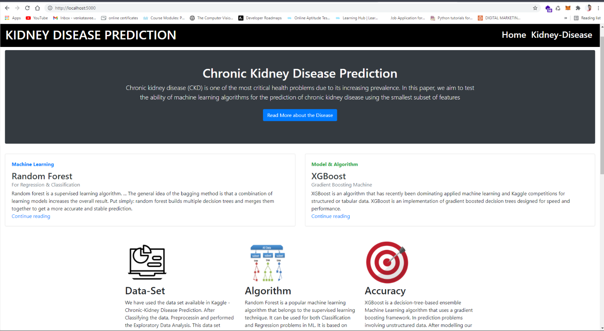
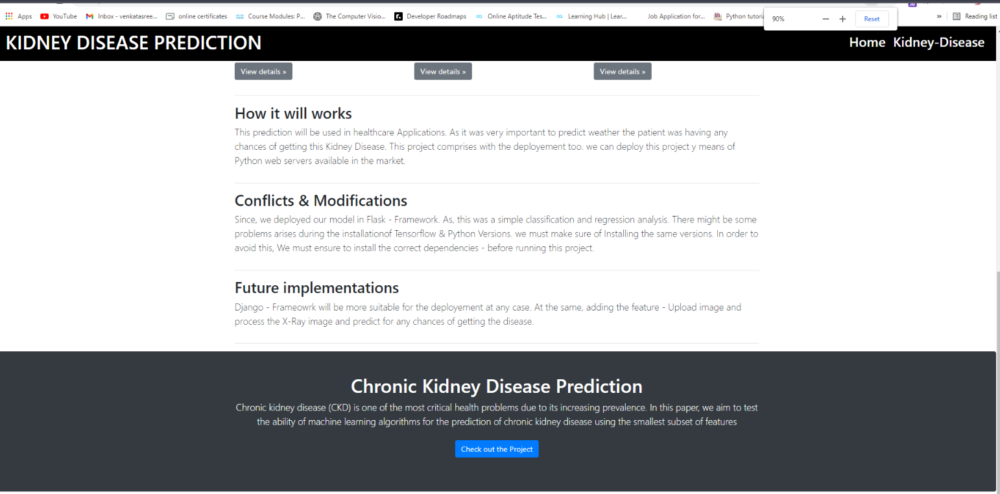
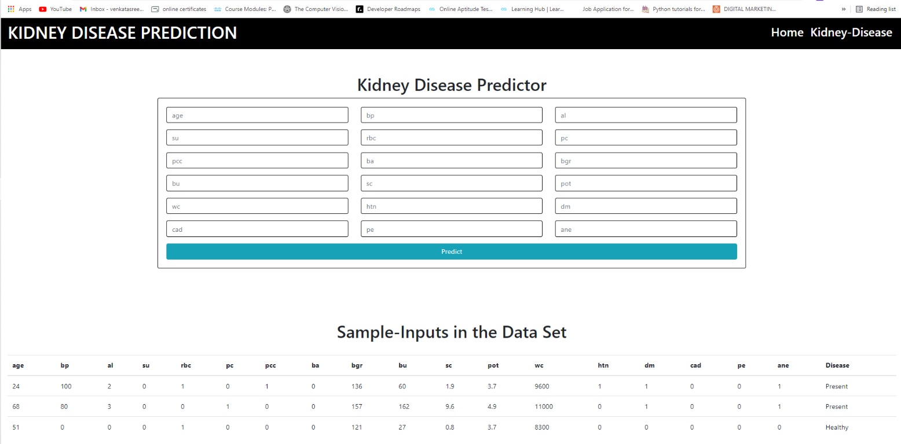
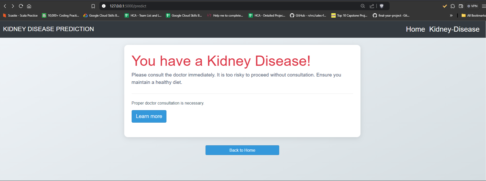
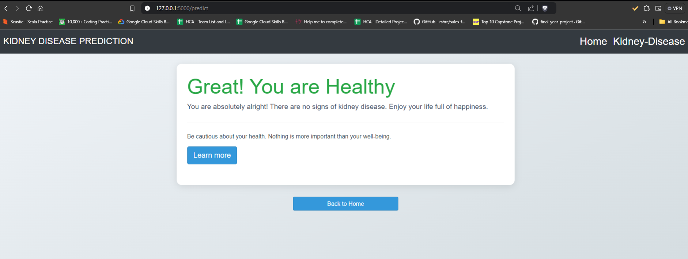

# Chronic-Kidney-Disease-Prediction

This web application was developed using the **Flask** web framework. The predictive models were trained on comprehensive datasets, enabling high accuracy in predicting chronic kidney disease. 

**Chronic-Kidney-Disease-Prediction**

## Dataset Links

The dataset was used from Kaggle.

- [Kidney Disease Dataset](https://www.kaggle.com/mansoordaku/ckdisease)

## Models with their Accuracy of Prediction

| Disease        | Type of Model            | Accuracy |
| -------------- | ------------------------ | -------- |
| Kidney-Disease       | Machine Learning Model   | 98%   |

